  

# Awesome-Online-Store-Builder
## Top Online Shop Builders Ecosystem

**Curated List of SaaS Products & Open-Source GitHub Projects**  
*Focused on Ecommerce Store Builders, Online Shops & Digital Retail Platforms*  
**Last updated: March 2026**

This repository tracks notable **SaaS platforms** and **open-source projects** for **Online Shop Builders**. These tools enable individuals and businesses to create, manage, and scale online stores with product catalogs, payments, order management, shipping, and customer experiences.

**Examples** include Shopify, Wix, WooCommerce, Zupain, and Catafy (the category leaders). Tools listed here emphasize **ease of use**, customization, payment integrations, and scalability for physical and digital products.

**Open-source emphasis**: This section is heavily expanded with every major active project for self-hosting, full code ownership, customization, and zero platform fees — ideal for developers, entrepreneurs, and businesses who want complete control over their online shop.

Contributions welcome! Open a PR to add/update entries. Keep descriptions factual and link to official sites.

## Table of Contents
- [SaaS Products](#saas-products)
- [Open-Source GitHub Projects](#open-source-github-projects)
- [How to Contribute](#how-to-contribute)
- [Disclaimer](#disclaimer)

## SaaS Products

### Core Platforms (Online Shop Builders)

| Product | Description | Pricing | Free Tier Limit | Company Size (Valuation / Revenue) |
| :--- | :--- | :--- | :--- | :--- |
| **[Shopify](https://www.shopify.com/)** | Leading ecommerce platform with powerful themes, apps, and built-in checkout for fast store creation. | Starts at $39/month (Basic plan, or $29/mo if billed annually). Special trial promos often offer $1/month for the first 3 months. | No permanent free tier. Offers a 3-day free trial (no credit card required) to build and test your store. | Valuation: ~$100B+ / Revenue: ~$11.6B/yr |
| **[WooCommerce](https://woocommerce.com/)** | Popular WordPress-based ecommerce solution with extensive plugins and flexibility. | Core plugin is free. Running a store typically costs $10–$50+/month for hosting, domain, and premium extensions. | Free core plugin (self-hosted). No SaaS limits, but requires self-paid hosting and domain. | Valuation: ~$7.5B (Automattic) / Revenue: ~$710M–$890M/yr |
| **[Wix](https://www.wix.com/)** | Drag-and-drop website builder with strong ecommerce capabilities and AI-assisted design. | Business/Ecommerce plans start at $27/month (billed annually). | Free plan available. Limits: 500 MB storage, 1 GB bandwidth, Wix-branded subdomain, Wix ads displayed, and no online payment processing. | Valuation: ~$2.1B / Revenue: ~$2.06B/yr |
| **[Zupain](https://zupain.com/)** | Modern online shop builder focused on user-friendly design and quick setup. | Plans start at approximately ₹499 - ₹999/month (or ₹6,999/year). | No permanent free tier. Custom onboarding and store setup services. | Valuation: Early-stage / Revenue: <$1.2M/yr |
| **[Catafy](https://catafy.com/)** | AI-enhanced platform for building and managing online stores with smart recommendations. | Paid plans start at approximately ₹499/month. | No permanent free tier. Offers a free trial with no credit card required. | Valuation: Early-stage / Revenue: <$600k/yr |

### Advanced & Specialized Platforms

**Other notable mentions**: BigCommerce, Squarespace, and various niche ecommerce builders.

## Open-Source GitHub Projects

### Dedicated Online Shop Builders

- **[MedusaJS](https://github.com/medusajs/medusa)**   
  Modern headless commerce engine built with Node.js. Highly flexible for custom online shops with admin panel and API-first architecture.

- **[Saleor](https://github.com/saleor/saleor)**   
  Open-source headless ecommerce platform with GraphQL API, excellent for building high-performance online stores.

- **[Spree Commerce](https://github.com/spree/spree)**   
  Ruby on Rails open-source ecommerce framework with REST API and modern storefront options.

- **[Reaction Commerce](https://github.com/reactioncommerce/reaction)**  (and forks)  
  Open-source headless commerce platform suitable for custom online shop experiences.

- **[WooCommerce](https://github.com/woocommerce/woocommerce)**   
  The most popular open-source ecommerce plugin for WordPress, offering full store building with themes, plugins, and complete code ownership.

- **[PrestaShop](https://github.com/PrestaShop/PrestaShop)**   
  Full-featured open-source ecommerce solution with a large module ecosystem.

- **[Sylius](https://github.com/Sylius/Sylius)**   
  Symfony-based open-source ecommerce framework focused on flexibility and customization.

- **[Vendure](https://github.com/vendure-ecommerce/vendure)**   
  TypeScript-based headless commerce framework designed for developer control and customization.

- **[OpenCart](https://github.com/opencart/opencart)**   
  Lightweight open-source ecommerce platform with easy setup and extensions.

- **[Bagisto](https://github.com/bagisto/bagisto)**   
  Laravel-based open-source ecommerce platform with multi-vendor and marketplace capabilities.

### Additional Strong Open-Source Options

- **[Odoo](https://github.com/odoo/odoo)**  — Full open-source ERP with powerful ecommerce modules.
- **[ERPNext](https://github.com/frappe/erpnext)**  — Open-source ERP with online store capabilities.
- **[Budibase](https://github.com/Budibase/budibase)**  — Open-source low-code platform for building custom shop admin panels.
- **[Saleor + Next.js** storefront starters for headless shops.
- **[MedusaJS + Next.js** templates for modern, developer-friendly stores.
- Many community **headless commerce** starters and multi-vendor solutions.

**Frameworks for building custom shops**: Combine **MedusaJS**, **Saleor**, or **WooCommerce** with **Next.js** and **Stripe** for fully open, high-performance online stores.

## How to Contribute

1. Fork the repo.
2. Add/edit entries in `README.md` (follow existing format).
3. Include: name, link, 1–2 sentence description, and whether it's SaaS or open-source.
4. Submit PR with a short explanation.

Star the repo if you find it useful!

## Disclaimer

- This is a **community-curated** list — not exhaustive and not an endorsement.
- Self-hosted open-source solutions require technical maintenance, hosting, security, and backups.
- Payment processing and tax compliance should be handled carefully in any ecommerce setup.

---

**Made for entrepreneurs, developers, e-commerce store owners, and indie hackers.**  
Let's make building online shops more accessible, customizable, and fully owned.

